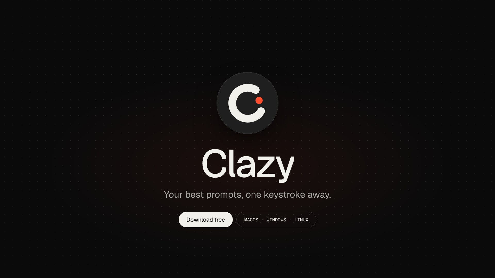

# Clazy

**Your best prompts, one keystroke away.**

Clazy is a small desktop app that saves the prompts you reuse every day and pastes them into any app: ChatGPT, Claude, Cursor, VS Code, your terminal, Slack. There are three ways to trigger a prompt:

| | How | Example |
|---|---|---|
| **Global hotkey** | One key combo per prompt | `Ctrl+Alt+1` → code-review prompt |
| **Text trigger** | Type a short abbreviation anywhere | `;push` → "commit & push" prompt |
| **Quick palette** | Search every prompt, press Enter | `Ctrl+Shift+Space` → type "review" |

Prompts can contain variables:

- `{{clipboard}}`: what you just copied
- `{{date}}`, `{{time}}`: the current date and time
- `{{cursor}}`: where the caret should land after pasting
- `{{subject}}`, `{{lang=Python}}`, `{{tone:formal|casual}}`: fill-ins that Clazy asks you for before pasting

Everything stays on your computer. There's no account, no network requests and no telemetry.

## Demo

[](site/assets/clazy-demo.mp4)

▶ **[Watch or download the demo video](site/assets/clazy-demo.mp4)** (1080p, 34 s, with sound). It's also on the landing page.

The video is made in code with [Remotion](https://www.remotion.dev) (see [`video/`](video/)). It uses the app's own design tokens, so it always matches the real UI. One shape morphs from scene to scene: dot → logo → text box → app window → keycaps → palette → fill-in form. The soundtrack is original: it's synthesised by [`video/scripts/make-music.mjs`](video/scripts/make-music.mjs) (120 BPM, A minor) with UI sound effects timed to the on-screen key presses. There are no samples and no licensed music, so you can use the video anywhere.

- 📄 Product spec: [`docs/PRD.md`](docs/PRD.md)
- 🌐 Landing page: [`site/`](site/) (deployed on Vercel)
- 💻 Desktop app: [`app/`](app/) (Tauri 2 + Rust + TypeScript)

## Download

Grab the installer for your system from the [latest release](https://github.com/Rachit315/Shortcut/releases/latest):

| System | File |
|---|---|
| macOS 11+ (Apple silicon & Intel) | [`Clazy-macos-universal.dmg`](https://github.com/Rachit315/Shortcut/releases/latest/download/Clazy-macos-universal.dmg) |
| Windows 10/11 | [`Clazy-windows-x64-setup.exe`](https://github.com/Rachit315/Shortcut/releases/latest/download/Clazy-windows-x64-setup.exe) · [`.msi`](https://github.com/Rachit315/Shortcut/releases/latest/download/Clazy-windows-x64.msi) |
| Linux (Ubuntu 22.04+, X11) | [`Clazy-linux-amd64.deb`](https://github.com/Rachit315/Shortcut/releases/latest/download/Clazy-linux-amd64.deb) · [`.AppImage`](https://github.com/Rachit315/Shortcut/releases/latest/download/Clazy-linux-amd64.AppImage) |

First launch:

- **macOS**: the app isn't notarized yet. Right-click it → *Open* (or *System Settings → Privacy & Security → Open Anyway*), then allow Clazy under *Accessibility*.
- **Windows**: the installer isn't code-signed yet. If SmartScreen appears, choose *More info → Run anyway*.
- **Linux**: `sudo apt install ./Clazy-linux-amd64.deb`. Global hotkeys and pasting need an X11 session.

## Develop

Prerequisites:

- Node 20+ and Rust (stable).
- On Linux, the Tauri system libraries:

  ```bash
  sudo apt install libwebkit2gtk-4.1-dev libayatana-appindicator3-dev librsvg2-dev libxdo-dev libxtst-dev patchelf
  ```

Run the app in dev mode:

```bash
cd app
npm ci                     # also generates the app icons from design/icon.svg
npm run tauri dev          # run the app with hot reload
```

To test with a throwaway library instead of your real one, set `CLAZY_DATA_DIR=/tmp/clazy-dev`.

### Tests

```bash
cd app
npm test                   # Vitest: key handling, search ranking, template preview
npm run test:rust          # cargo test: templates, hotkeys, triggers, database, import/export
npx playwright test        # UI flows (mocked backend) + landing page
npx tauri build --no-bundle && bash e2e/run.sh     # real end-to-end test (Linux, needs Xvfb, xdotool, xclip, python3-tk)
```

The end-to-end test starts the real binary on a virtual X display. It then presses hotkeys, types triggers and uses the palette with `xdotool`, and checks what lands in a separate text-editor window. It covers:

- global hotkeys
- text triggers
- `{{cursor}}` and `{{clipboard}}`
- restoring your clipboard after a paste
- the palette's search and fill-in form
- usage stats

CI runs all of the above on every push (see `.github/workflows/ci.yml`).

### Demo video

```bash
cd video
npm install
npm run studio     # preview and edit in Remotion Studio
npm run render     # regenerates the soundtrack, then writes site/assets/clazy-demo.mp4
```

The scenes live in `video/src/Demo.tsx`. `video/src/timeline.json` holds the scene start frames and sound-effect cues, and the soundtrack generator reads it too, so music and picture stay in sync. Remotion is free for individuals and small teams; check [its license](https://www.remotion.dev/license) if your company has more than three people.

### Typography

The type system is designed for **PP Neue Montreal** (interface and headings) and **Söhne Mono** (prompt text, hotkeys and triggers). Both are commercial fonts, so they aren't bundled. Clazy ships **Geist** and **Geist Mono** (SIL OFL) as the built-in fallback. If you own licences for the designed fonts and have them installed, the app and the site use them automatically, because they come first in the font stacks in `design/tokens.json`.

| Element | Font | Size / weight |
|---|---|---|
| Page headings ("All prompts") | Neue Montreal | 32 / 500 |
| Prompt names | Neue Montreal | 16 / 500 |
| Previews | Neue Montreal | 14 / 400 |
| Labels ("FOLDERS") | Neue Montreal | 11 / 600, uppercase, 0.08em |
| Prompt content | Söhne Mono | 15 / 400 |
| Hotkeys, triggers | Söhne Mono | 12 / 500 |

### Design tokens

`design/tokens.json` is the single source for colours, type, spacing and radii. After editing it, run `node design/build-tokens.mjs` to regenerate `app/src/styles/tokens.css` and `site/assets/tokens.css`. CI fails if they drift.

## Release

1. Bump `version` in `app/src-tauri/tauri.conf.json` and `app/src-tauri/Cargo.toml`.
2. Run the **Release** workflow from the Actions tab (or push a tag such as `v0.2.0`).

`.github/workflows/release.yml` builds macOS (universal), Windows and Linux installers. Only after all three succeed does it publish a GitHub release with stable file names (`Clazy-macos-universal.dmg`, …), so `releases/latest/download/<name>` always points at the newest build.

## Landing page

`site/` is a static page with no build step, deployed on Vercel. Download buttons use `/download/macos`, `/download/windows`, `/download/windows-msi`, `/download/linux-deb` and `/download/linux-appimage`. Vercel redirects these to the matching assets of the latest GitHub release, so they work without JavaScript and always serve the newest build. Before the first release exists, the page says so instead of showing dead links.

**Deploying on Vercel:** *Add New → Project*, import this repository and click **Deploy**. Keep the default settings, because the root `vercel.json` already tells Vercel to publish `site/` with no install or build step. Or set **Root Directory** to `site`, in which case `site/vercel.json` is used. Both files hold the same redirects, and a test keeps them in sync.

`node site/serve.mjs` serves the page locally with the same redirects. If you fork the project, change the repository name in both `vercel.json` files and in `site/assets/config.js`.

## Project layout

```
app/
  src-tauri/src/
    template.rs    template language ({{clipboard}}, {{cursor}}, fill-ins)
    hotkey.rs      hotkey normalisation, validation, conflict warnings
    triggers.rs    text-trigger validation + rolling-buffer matcher
    listener.rs    OS keyboard listeners (rdev on Win/Linux, CGEventTap on macOS)
    paste.rs       paste worker: clipboard swap, keystroke injection, restore
    platform.rs    focus save/restore, macOS permission, Wayland detection
    db.rs          SQLite store, starter pack, import merge
    io.rs          JSON / Markdown import & export
    engine.rs      runtime glue: hotkeys, triggers, palette
    commands.rs    IPC commands for the UI
  src/             main window, palette, product tour, settings (TypeScript)
  tests/           Playwright tests (+ mock backend)
  e2e/             real desktop end-to-end test
site/              landing page
design/            design tokens
video/             demo video (Remotion) + soundtrack generator
docs/PRD.md        product requirements
```

## Known limitations

- **Wayland:** global hotkeys and paste injection work only in XWayland apps.
- **Secure input:** password fields and macOS Secure Input block synthetic input by design.
- **Terminals:** some Linux terminals need the `Ctrl+Shift+V` paste keystroke. Set it in *Settings → Pasting*.
- **Code signing:** builds are unsigned until certificates are added.

## License

MIT
